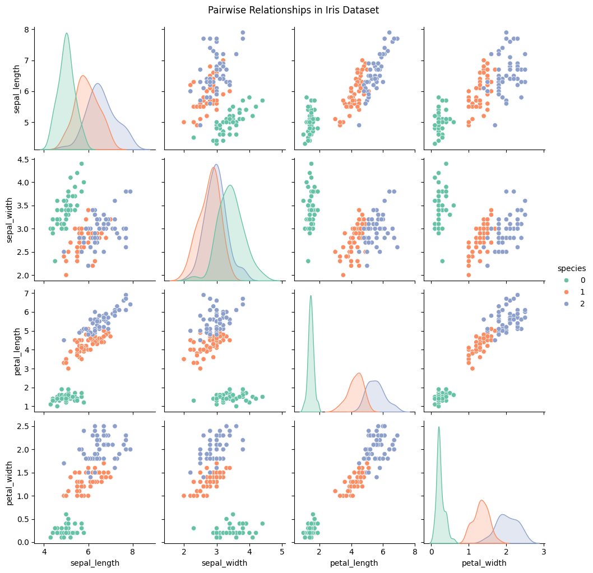
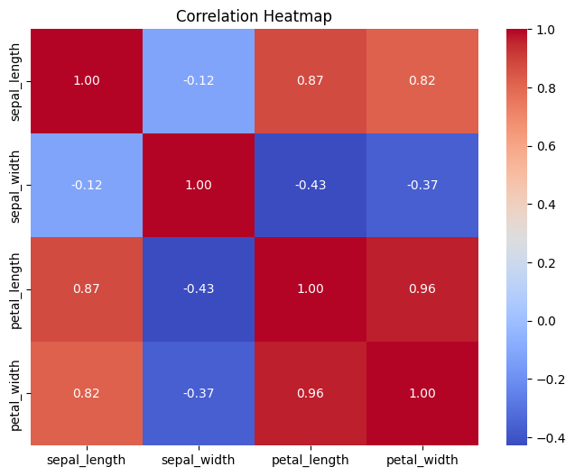

# PRODIGY_DS_02
Data Cleaning and Exploratory Data Analysis!

## Overview
This repository contains a comprehensive data cleaning and exploratory data analysis (EDA) project. The goal is to prepare a dataset for further analysis or machine learning tasks by cleaning it and performing exploratory data analysis to understand its structure, patterns, and insights. For the data of my choice, I used the `Iris dataset`. As a bonus, I performed machine learning tasks using the cleaned dataset.

## Tables of Contents
1. [Data Cleaning](#data-cleaning)
2. [Exploratory Data Analysis](#exploratory-data-analysis)
3. [Predictive Analysis](#predictive-analysis)
4. [Model Saving and Loading](#model-saving-and-loading)
5. [Deployment](#deployment)
6. [How to Reproduce](#how-to-reproduce)
7. [Conclusion](#conclusion)
8. [Future Work](#future-work)
9. [License](#license)

## Data Cleaning
**Load the data:**
```python
# Load the Iris dataset
iris = load_iris()
iris_df = pd.DataFrame(data=iris.data, columns=iris.feature_names)
iris_df['species'] = iris.target
iris_df.head()
```

In the data cleaning process, I *handled missing values*, *removed duplicates*, *checked for outliers*, and *ensured consistent formatting across the dataset*. This step is crucial for improving the quality of the data and ensuring accurate analysis.

Since the dataset is relatively clean, the cleaning process was rather easy.

I decided to keep the outliers since outliers may represent natural variation in flower morphology. I will compare the models' accuracy with and without outliers.

## Exploratory Data Analysis
The EDA process involved visualizing the data to understand its distribution, relationships, and potential patterns. I used various plots such as histograms, scatter plots, and box plots to gain insights into the dataset. These visualizations helped identify trends and correlations between different features.

**Pair Wise Plot**

The Pair Wise Plot shows the relationships between different features in the Iris dataset, helping to identify potential correlations and patterns.

**Correlation Matrix**

The Correlation Matrix provides insights into the relationships between different features in the dataset, helping to identify which features are positively or negatively correlated.

Other visualizations used include:
    - Bar plots
    - Scatter plots with trend lines which compares petal length and petal width and sepal length and sepal width.

## Predictive Analysis
In this section, I applied machine learning algorithms to the cleaned dataset to predict the species of iris flowers based on their features `(sepal length, sepal width, petal length, petal width)`. The models used include Logistic Regression and Random Forest Classifier. I evaluated the performance of each model using accuracy scores and classification reports.

**Results of Logistic Regression and Random Forest Classifier**
```
Logistic Regression Accuracy: 1.0
              precision    recall  f1-score   support

           0       1.00      1.00      1.00        10
           1       1.00      1.00      1.00         9
           2       1.00      1.00      1.00        11

    accuracy                           1.00        30
   macro avg       1.00      1.00      1.00        30
weighted avg       1.00      1.00      1.00        30

Random Forest Accuracy: 1.0
              precision    recall  f1-score   support

           0       1.00      1.00      1.00        10
           1       1.00      1.00      1.00         9
           2       1.00      1.00      1.00        11

    accuracy                           1.00        30
   macro avg       1.00      1.00      1.00        30
weighted avg       1.00      1.00      1.00        30
```
Since both models achieved perfect accuracy, it indicates that they were able to classify all test samples correctly. This is a strong result, but it is important to consider the possibility of overfitting, especially if the dataset is small or not representative of the broader population.

**Most Important Features**


`The visualization of the most important features indicates that petal length and petal width are the most significant predictors for classifying iris species.`

**Results of the classification report**
```
precision    recall  f1-score   support

      setosa       1.00      1.00      1.00        10
  versicolor       1.00      1.00      1.00         9
   virginica       1.00      1.00      1.00        11

    accuracy                           1.00        30
   macro avg       1.00      1.00      1.00        30
weighted avg       1.00      1.00      1.00        30
```
The random forest classifier achieved perfect accuracy, indicating that it was able to classify all test samples correctly.

To validate the model's performance, I performed cross-validation. The results showed consistent accuracy across different folds, reinforcing the model's reliability.
```
Random Forest CV accuracy: 0.9666666666666668
              precision    recall  f1-score   support

           0       1.00      1.00      1.00        50
           1       0.96      0.94      0.95        50
           2       0.94      0.96      0.95        50

    accuracy                           0.97       150
   macro avg       0.97      0.97      0.97       150
weighted avg       0.97      0.97      0.97       150
```
Cross-validation (testing on different splits of the data), Random Forest consistently hit ~97% accuracy.

The detailed classification report from cross-validation shows that the model performs well across all species, with high precision, recall, and F1-scores.

- On a stratified 20% hold-out, LR/RF achieved 100%; 5-fold CV mean ≈ 97% ± (std), which is the more realistic generalization estimate.

## Model Saving and Loading

The model was saved using the `joblib` library, which allows for easy serialization and deserialization of Python objects. This enables the model to be reused without the need for retraining, saving time and computational resources.

To save and load the model:
```python
# Save model
joblib.dump(final_model, r"model/iris_random_forest.pkl")

# Load model
model = joblib.load(r"model/iris_random_forest.pkl")
```

## Deployment
Run the model with streamlit on the terminal:
```
streamlit run Model.py
```


## How to Reproduce

1. Clone the repository.
```bash
git clone https://github.com/Campeon254/PRODIGY_DS_02.git

```
2. Install the required packages using
```bash
pip install -r requirements.txt
```
3. Run the Jupyter Notebook `Iris Data Analysis.ipynb` to reproduce the analysis and modeling steps.
```bash
jupyter notebook "Iris Data Analysis.ipynb"
```
4. Run the model with streamlit
```
streamlit run Model.py
```


## Conclusion
In future work, it would be beneficial to gather more data, perform cross-validation, and explore other models or techniques to ensure the robustness and generalizability of the findings.

## Future Work
- Add more ML models (SVM, k-NN) for comparison
- Hyperparameter tuning with GridSearchCV

## Project Structure
```
|-- model
|   |-- iris_random_forest.pkl
|-- Visualizations
|   |-- Important Features.png
|   |-- Iris Classifier.png
|   |-- Correlation.png
|   |-- Pairplot.png
|-- requirements.txt
|-- Model.py
|-- Iris Data Analysis.ipynb
|-- README.md
|-- License
```

## License

This project is licensed under the MIT License - see the [LICENSE](LICENSE) file for details.
